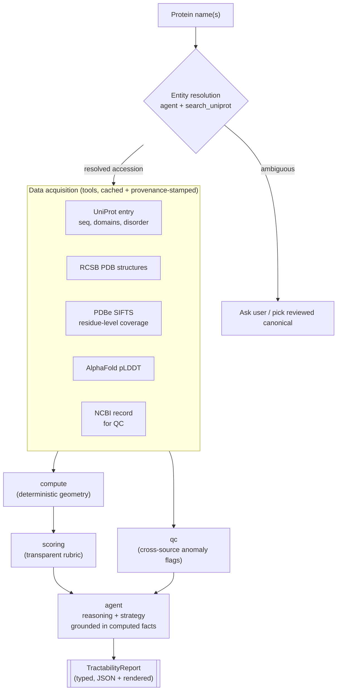

# tractable

**Agentic assessment of how tractable a protein is for experimental structure determination.**

Give it a protein name. It resolves the protein, pulls every experimental
structure and the AlphaFold model from public databases, computes how much of
the chain is actually solved, and returns a structured tractability report with
a transparent score and a recommended experimental strategy.

It is built as an **LLM agent over deterministic tools**: the model orchestrates
data acquisition and writes the reasoning, but it never invents a number. Every
coverage percentage, domain status, and score in the report is computed by pure,
unit-tested code from real database records, and every datum carries its
provenance.

---

## Example output

```
Protein: BRCA1 (P38398, Homo sapiens)
Sequence Length: 1863 aa
Experimental Structures Found: 27

Coverage:
  Residues 1–1650: 42% experimentally covered

Domains:
  ✓ BRCT domain      (1646–1859)  solved
  ✓ RING domain      (24–64)      solved
  ✗ Central region   (200–1640)   disordered / unsolved

Structure Determination Score: 68 / 100   [rubric v1, illustrative]

Reasoning:
  - Multiple experimentally determined, well-defined domains
  - Strong AlphaFold confidence across the structured regions
  - Large unsolved flexible linker lowers full-length tractability

Recommended Strategy:
  - Express and solve the folded domains separately
  - Consider cryo-EM for any full-length complex

QC:
  ⚠ UniProt length (1863) vs NCBI RefSeq length (1863): consistent
```

The numeric fields are produced by `compute` and `scoring`; the *Reasoning* and
*Recommended Strategy* lines are the only model-authored fields, and they are
constrained to the computed facts above them.

---

## Why it is built this way

The single most important design decision: **separate what must be exact from
what benefits from judgment.**

| Concern | Owner | Why |
|---|---|---|
| Residue coverage, domain status, score | deterministic code (`compute`, `scoring`) | Numbers must be reproducible and auditable, never hallucinated |
| Which databases to query, retries, isoform/organism disambiguation | LLM agent (`agent`) | Genuine multi-step reasoning over messy, heterogeneous sources |
| Reasoning bullets + experimental strategy | LLM agent, grounded in computed facts | Domain expertise that a lookup table can't capture |
| Cross-source consistency / anomaly flags | `qc` | Catch silent data problems before they reach a report |
| Source + identifier + timestamp on every field | `provenance` | Reproducibility and auditing |

If the model produced the coverage numbers directly, the tool would be
worthless to anyone who actually determines structures. So it doesn't.

---

## Architecture



The agent's only sources of truth are the tool outputs and the computed facts.
The tool-use loop is hand-rolled against the Anthropic SDK rather than hidden
behind a framework, so the orchestration and the prompts are fully inspectable.

## Data sources

| Source | Used for |
|---|---|
| [UniProt REST](https://rest.uniprot.org) | name → accession, sequence, length, domain & disorder features |
| [RCSB PDB](https://search.rcsb.org) | experimental structures for an accession |
| [PDBe SIFTS](https://www.ebi.ac.uk/pdbe/api/doc/sifts.html) | authoritative per-residue UniProt↔PDB coverage |
| [AlphaFold DB](https://alphafold.ebi.ac.uk) | per-residue pLDDT confidence |
| [NCBI E-utilities](https://www.ncbi.nlm.nih.gov/books/NBK25501/) | cross-source QC |

All tool calls are cached on disk so the test suite runs offline and we stay
within each service's rate limits and usage policy.

## Scoring rubric (v1, uncalibrated)

The score is an explicit additive function — not a model output — so it can be
inspected and argued with:

```
total = clamp(
    45 · coverage_fraction              # how much chain is already solved
  + 30 · solvable_domain_fraction       # folded domains that are separable
  + 25 · (mean_pLDDT_uncovered / 100)   # are the gaps orderly & fillable?
  - 20 · disordered_fraction,           # flexible linkers hurt tractability
    0, 100)
```

Weights are v1 defaults and are explicitly *not* claimed to be final — the
roadmap is to calibrate them against a labelled benchmark of known-tractable
vs. known-intractable targets. The rubric version is recorded in every report.

## Quickstart

```bash
git clone https://github.com/djokerdude/protein-structure-tractability
cd protein-structure-tractability
python -m venv .venv && source .venv/bin/activate
pip install -e ".[dev]"
cp .env.example .env   # add your ANTHROPIC_API_KEY

pytest                 # deterministic core is fully tested, offline
tractable "BRCA1"      # (CLI, once the agent loop lands — see status)
```

## Project layout

```
src/tractable/
  schema.py     typed report model — the contract for everything
  compute.py    deterministic residue geometry (coverage, domains, gaps)
  scoring.py    transparent additive rubric
  tools/        one small, cached, provenance-stamped fn per data source
  qc.py         cross-source consistency / anomaly detection      [planned]
  agent.py      Anthropic tool-use loop: resolution + reasoning    [planned]
  render.py     report → markdown / text                          [planned]
tests/          unit tests for compute & scoring (no network)
```

## Status

This repo is built deterministic-core-first, on purpose: the parts that must be
correct are correct and tested before any LLM touches them.

- [x] Typed report schema
- [x] Deterministic coverage / domain / missing-region math (tested)
- [x] Transparent scoring rubric (tested)
- [x] Tool interfaces defined against real endpoints
- [ ] Tool implementations + on-disk response cache
- [ ] QC / cross-source anomaly detection
- [ ] Agent tool-use loop (Anthropic SDK) + entity resolution
- [ ] Report rendering + CLI
- [ ] Rubric calibration against a labelled target set

## Notes

A portfolio project exploring agentic biomedical data acquisition, ETL, and
quality control. The structure-determination domain logic draws on prior
graduate research in cryo-EM structure determination and molecular dynamics.
