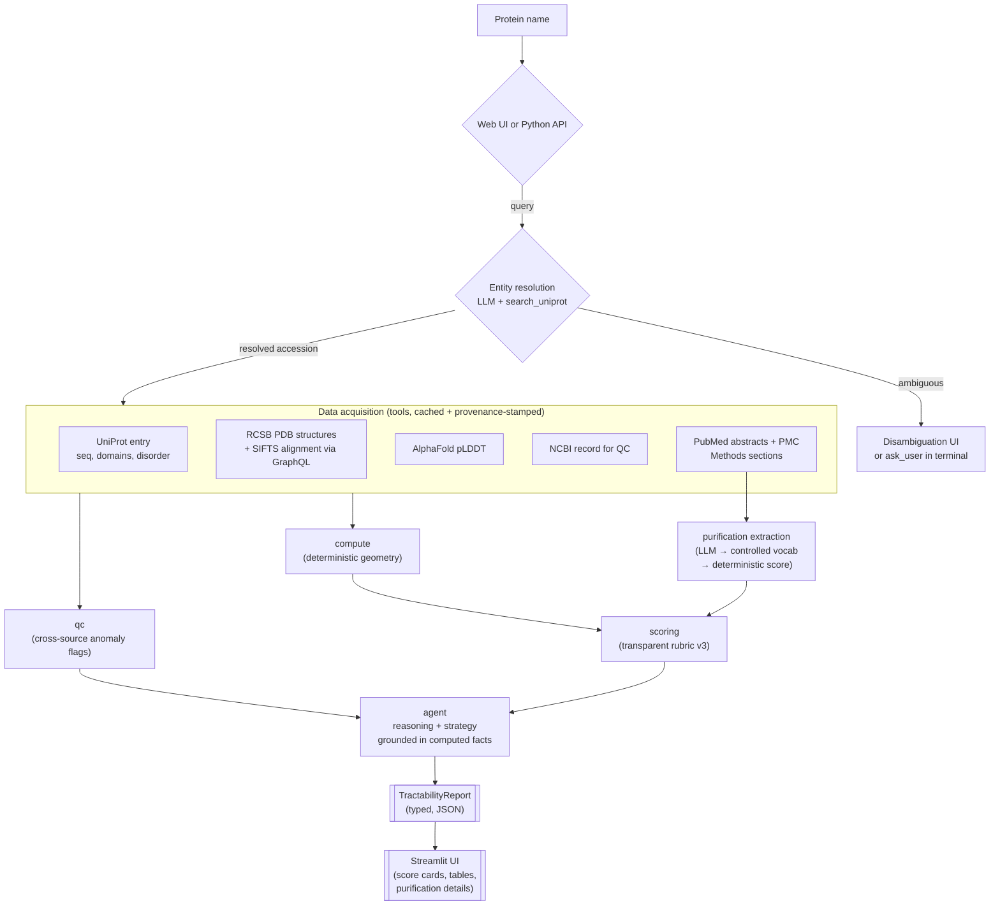

# tractable

**Agentic assessment of how tractable a protein is for experimental structure determination.**

Give it a protein name. It resolves the protein, pulls every experimental
structure and the AlphaFold model from public databases, extracts purification
protocol data from primary literature, computes how much of the chain is
actually solved, and returns a structured tractability report with a transparent
score and a recommended experimental strategy.

It is built as an **LLM agent over deterministic tools**: the model orchestrates
data acquisition, extracts protocol information from PubMed abstracts and
open-access Methods sections, and writes the reasoning — but it never invents a
number. Every coverage percentage, domain status, and score in the report is
computed by pure, unit-tested code from real database records, and every datum
carries its provenance.

---

## How to run

### Web UI (recommended)

```bash
git clone <repo>
cd protein-structure-tractability
python -m venv .venv && source .venv/bin/activate
pip install -e ".[dev]"
cp .env.example .env   # add your ANTHROPIC_API_KEY

tractable-ui            # opens http://localhost:8501
# or: streamlit run src/tractable/ui.py
```

Type a protein name, gene symbol, or UniProt accession. If the query is
ambiguous the UI shows a candidate list for you to select from. Progress
updates stream step-by-step as data is acquired and scored.

### Python API

```python
from tractable.agent import assess
import json

report = assess("BRCA1")
print(json.dumps(report.model_dump(mode="json"), indent=2))
```

---

## Example output — BRCA1

BRCA1 is a useful example: the BRCT domains at the C-terminus are well-solved,
but the 1863-aa chain is largely disordered and uncharacterised — a challenging
target that scores notably lower than a well-trodden kinase.

```
Protein: Breast cancer type 1 susceptibility protein (P38398, Homo sapiens)
Sequence length: 1863 aa
Experimental structures: 33  (X-ray, cryo-EM, NMR)

Coverage:
  Overall: 17.6%  |  Disordered: 19.7%
  High-res structures (< 3.0 Å): 58.1%  →  confidence score 58.1 / 100

Domains:
  ✓ BRCT 1  (1642–1736)  solved, coverage  96%, mean pLDDT 91
  ✓ BRCT 2  (1756–1855)  solved, coverage 100%, mean pLDDT 90

Missing regions (≥ 10 aa):
  230–270, 306–338, 534–570, 654–709,
  1181–1216, 1322–1387, 1440–1505, 1565–1596

Purification tractability — 4 protocols (2 with full Methods section):
  8RS8  [methods]  E. coli His6-SUMO fusion  |  cobalt affinity → SEC
                   Tag cleaved with GST-3C; crystallised with RIF1 pS2265 peptide.
  4Y2G  [methods]  Unknown system            |  steps in Supplemental (unavailable)
                   Co-crystallised with Abraxas phosphopeptide at 30 mg/ml.
  1Y98  [abstract] Unknown system            |  no details — abstract only
  4IFI  [abstract] Unknown system            |  no details — abstract only
  Purification score: 61.2 / 100  (2 of 4 papers behind paywall)

Score: 51.09 / 100  [v3-uncalibrated]
  Coverage points     :  6.16 / 35
  Domain points       : 25.00 / 25
  Confidence points   : 11.61 / 20
  Purification points : 12.25 / 20
  Disorder penalty    : -3.94 / -20

QC flags:
  [WARNING] LOW_COVERAGE: Experimental coverage 17.6% is below 25%;
            large portions of the chain are unexplored.

Reasoning:
  - Score is dominated by strong domain-level coverage: both tandem BRCT
    repeats are fully solved (pLDDT 90–91), earning maximum domain points.
  - Experimental coverage is only 17.6% of the 1863-aa chain, triggering a
    LOW_COVERAGE warning and yielding just 6.16/35 coverage points — the
    characterised region is essentially confined to the C-terminal BRCT module.
  - A 19.7% disordered fraction plus numerous long missing regions (654–709,
    1322–1387, 1440–1505) reflects extensive intrinsically disordered sequence
    outside the BRCT domains, contributing a -3.94 disorder penalty.
  - The single well-documented protocol (8RS8) shows BRCT2 expresses well
    in E. coli as a His6-SUMO fusion, purified by cobalt affinity, SUMO
    cleavage, and Superdex 75 SEC — a clean, reproducible route for this domain.

Recommended Strategy:
  - Express the tandem BRCT repeats (residues 1642–1855) in E. coli following
    the validated 8RS8 route: His6-SUMO fusion, cobalt affinity, SUMO/3C
    cleavage, Superdex 75 SEC.
  - Pursue BRCT–phosphopeptide co-crystallisation as the proven structural
    strategy (CtIP, Abraxas, RIF1, ATRIP all in the PDB).
  - Treat the large N-terminal and central uncharacterised regions (missing
    spans 230–270, 654–709, 1322–1387, 1440–1505) as candidates for separate
    domain-boundary mapping; express each stable subfragment independently.
  - For the high disordered fraction, consider NMR or peptide-based approaches
    on short ordered motifs; use predicted disorder to trim flexible linkers
    before expression.
```

The numeric fields are produced by `compute`, `scoring`, and `purification`; the
*Reasoning* and *Recommended Strategy* lines are the only model-authored fields,
grounded strictly in the computed facts above them.

---

## Why it is built this way

The single most important design decision: **separate what must be exact from
what benefits from judgment.**

| Concern | Owner | Why |
|---|---|---|
| Residue coverage, domain status, score | deterministic code (`compute`, `scoring`, `purification`) | Numbers must be reproducible and auditable, never hallucinated |
| Which databases to query, isoform/organism disambiguation | LLM agent (`agent`) | Genuine multi-step reasoning over messy, heterogeneous sources |
| Protocol field extraction (expression system, steps, yield) | LLM, validated against controlled vocabulary | Structured extraction from natural-language text |
| Reasoning bullets + experimental strategy | LLM, grounded in computed facts | Domain expertise that a lookup table can't capture |
| Cross-source consistency / anomaly flags | `qc` | Catch silent data problems before they reach a report |
| Source + identifier + timestamp on every field | `provenance` | Reproducibility and auditing |

If the model produced the coverage numbers directly, the tool would be
worthless to anyone who actually determines structures. So it doesn't.

---

## Architecture



The agent's only sources of truth are the tool outputs and the computed facts.
The tool-use loop is hand-rolled against the Anthropic SDK rather than hidden
behind a framework, so the orchestration and the prompts are fully inspectable.

---

## Data sources

| Source | Used for |
|---|---|
| [UniProt REST](https://rest.uniprot.org) | name → accession, sequence, length, domain & disorder features |
| [RCSB PDB Search v2](https://search.rcsb.org) | experimental structures for an accession |
| [RCSB PDB GraphQL](https://data.rcsb.org/graphql) | SIFTS-derived per-residue UniProt↔PDB alignment, primary citation metadata |
| [AlphaFold DB](https://alphafold.ebi.ac.uk) | per-residue pLDDT confidence (B-factor column of AlphaFold PDB file) |
| [NCBI E-utilities](https://www.ncbi.nlm.nih.gov/books/NBK25501/) | cross-source QC (protein length); PubMed abstract text via efetch |
| [PubMed Central](https://www.ncbi.nlm.nih.gov/pmc/) | full Methods sections for open-access papers (~60–75% of structural biology literature) |

All tool calls are cached on disk (`tests/fixtures/`) so the test suite runs
offline and we respect each service's rate limits and usage policy. Paywalled
papers fall back to abstract; the report notes what fraction of cited papers
were accessible.

---

## Scoring rubric (v3, uncalibrated)

The score is an explicit additive function — not a model output — so it can be
inspected and argued with:

```
total = clamp(
    35 · coverage_fraction              # how much chain is already solved
  + 25 · solvable_domain_fraction       # folded domains that are separable
  + 20 · (confidence_score / 100)       # primary: fraction of structures < 3 Å
                                        # fallback: mean AlphaFold pLDDT over
                                        #           uncovered ordered residues
  + 20 · (purification_score / 100)     # expression system + steps + yield
                                        # (from LLM-extracted protocol data)
  - 20 · disordered_fraction,           # flexible linkers hurt tractability
    0, 100)
```

**Confidence score** uses the fraction of structures resolved below 3.0 Å as
the primary signal. When no structures with resolution data exist, it falls back
to mean AlphaFold pLDDT over uncovered ordered residues.

**Purification score** is derived from protocols extracted by the LLM from
PubMed/PMC text of high-resolution structure primary citations. The LLM
populates controlled-vocabulary fields; deterministic code converts them to a
0–100 score using expression-system base rates (E. coli = 100, insect = 50,
mammalian = 25), step-count penalties, co-expression penalties, and yield
adjustments. Returns `None` (0 points) when no protocol data is available.

Weights are v3 defaults, explicitly *uncalibrated* — the roadmap is to tune
them against a labelled benchmark of known-tractable vs. known-intractable
targets. The rubric version is recorded in every report.

---

## Project layout

```
src/tractable/
  schema.py       typed report model — the contract for everything
  compute.py      deterministic residue geometry (coverage, domains, gaps)
  scoring.py      transparent additive rubric (v3, 5 terms)
  purification.py deterministic purification tractability scoring
  tools/          one cached, provenance-stamped fn per data source
    __init__.py   search_uniprot, get_uniprot_entry, get_pdb_structures,
                  get_sifts_coverage, get_alphafold_plddt, get_ncbi_record,
                  get_pubmed_abstracts, get_pmc_fulltext
  qc.py           cross-source consistency / anomaly detection
  agent.py        Anthropic tool-use loop: entity resolution, purification
                  extraction, and LLM narrative (grounded in computed facts)
  ui.py           Streamlit web UI (search, disambiguation, live progress,
                  tabbed report — score cards, domains, structures, purification)
  render.py       report → markdown / text                          [planned]
  cli.py          `tractable "BRCA1"` terminal entrypoint           [planned]
tests/
  fixtures/       cached API responses — test suite runs fully offline
  test_compute.py
  test_qc.py
  test_scoring.py
```

---

## Status

- [x] Typed report schema (`schema.py`)
- [x] Deterministic coverage / domain / missing-region math (tested)
- [x] Transparent scoring rubric v3 (tested)
- [x] Tool implementations with on-disk caching and provenance (`tools/`)
- [x] Cross-source QC / anomaly detection (tested)
- [x] Agent tool-use loop — entity resolution, data acquisition, LLM narrative
- [x] Purification tractability — PubMed + PMC full-text extraction, LLM protocol parsing, deterministic scoring
- [x] PMC open-access Methods section fetching (paywall transparency notes)
- [x] Streamlit web UI — search, disambiguation, step-by-step progress, tabbed report
- [ ] CLI (`tractable "BRCA1"`) and formatted text renderer (`render.py`)
- [ ] Rubric calibration against a labelled target set

---

## Notes

A portfolio project exploring agentic biomedical data acquisition, ETL, and
quality control. The structure-determination domain logic draws on prior
graduate research in cryo-EM structure determination and molecular dynamics.
