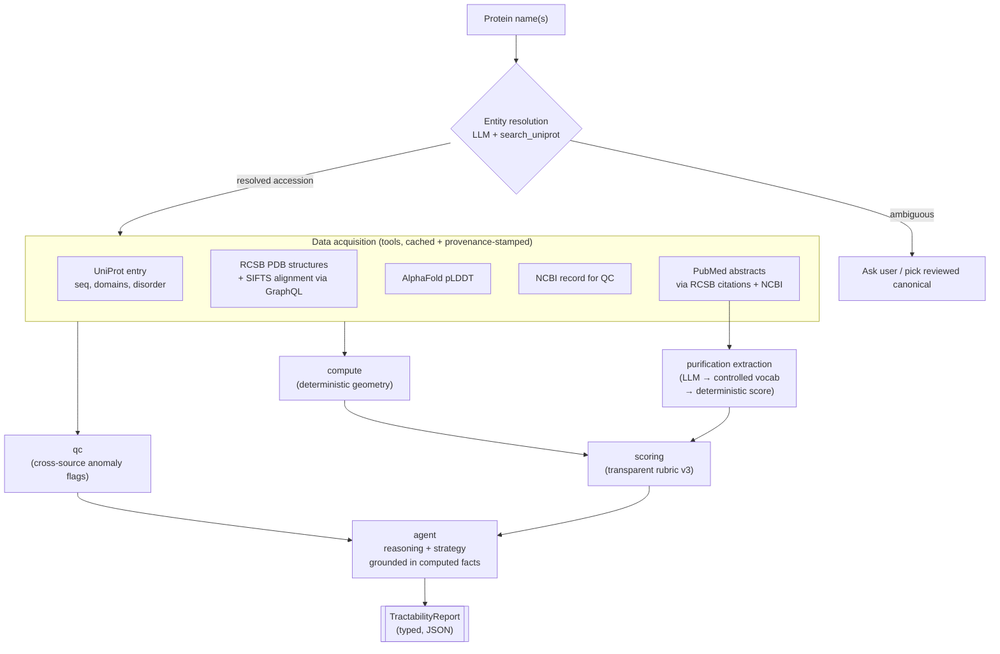

# tractable

**Agentic assessment of how tractable a protein is for experimental structure determination.**

Give it a protein name. It resolves the protein, pulls every experimental
structure and the AlphaFold model from public databases, extracts purification
protocol data from primary literature, computes how much of the chain is
actually solved, and returns a structured tractability report with a transparent
score and a recommended experimental strategy.

It is built as an **LLM agent over deterministic tools**: the model orchestrates
data acquisition, extracts protocol information from PubMed abstracts, and
writes the reasoning — but it never invents a number. Every coverage percentage,
domain status, and score in the report is computed by pure, unit-tested code
from real database records, and every datum carries its provenance.

---

## Example output — SARM1

```
Protein: NAD(+) hydrolase SARM1 (Q6SZW1, Homo sapiens)
Sequence length: 724 aa
Experimental structures: 55 (cryo-EM + X-ray)

Coverage:
  Overall: 100%  |  Disordered: 2.9%
  High-res structures (< 3.0 Å): 70.9%  →  confidence score 70.9 / 100

Domains:
  ✓ SAM 1  (412–476)  solved, coverage 100%, mean pLDDT 97
  ✓ SAM 2  (486–548)  solved, coverage 100%, mean pLDDT 94
  ✓ TIR    (560–703)  solved, coverage 100%, mean pLDDT 88

Missing regions: none

Purification tractability:
  Protocols from primary citations: 3  (PubMed: 33053563, 39964720, 36550129)
  Expression system: unknown (not reported in abstracts)
  Purification score: 50.0 / 100  (neutral — no documented steps in abstracts)

Score: 83.6 / 100  [v3-uncalibrated]
  Coverage points     : 35.00 / 35
  Domain points       : 25.00 / 25
  Confidence points   : 14.18 / 20
  Purification points : 10.00 / 20
  Disorder penalty    :  -0.58 / -20

Reasoning:
  - Full experimental coverage (100%) and negligible disorder (2.9%) yield
    maximum coverage and domain points with a trivial penalty.
  - All three annotated domains (SAM 1, SAM 2, TIR) are solved at 100%
    coverage with high mean pLDDT (97, 94, 88), giving full domain points.
  - Confidence is moderated: 70.9% of structures are below 3.0 Å, reflecting
    the predominance of moderate-resolution cryo-EM over crystallography.
  - Purification is the main weakness: all three primary citations report
    cryo-EM structures but specify no expression system, steps, or yields in
    the abstract — reproducing sample prep requires de novo development.

Recommended Strategy:
  - Pursue full-length cryo-EM of the octamer; use nanobody Nb-C6 as a
    conformation trap for the NMN-activated form (precedent: 8GQ5).
  - Express the TIR domain (560–703) independently for higher-resolution
    active-site work — it is the catalytic module and fully solved.
  - Develop and document a reproducible purification protocol: no primary
    citation specifies steps or yields — this is the biggest practical gap.
  - Use M1 activator + nonhydrolyzable NAD+ analog 1AD to stabilise defined
    activation intermediates (precedent: 9L2D).

QC flags: none
```

The numeric fields are produced by `compute`, `scoring`, and `purification`; the
*Reasoning* and *Recommended Strategy* lines are the only model-authored fields,
grounded strictly in the computed facts above them.

---

## Why it is built this way

The single most important design decision: **separate what must be exact from
what benefits from judgment.**

| Concern | Owner | Why |
|---|---|---|
| Residue coverage, domain status, score | deterministic code (`compute`, `scoring`, `purification`) | Numbers must be reproducible and auditable, never hallucinated |
| Which databases to query, isoform/organism disambiguation | LLM agent (`agent`) | Genuine multi-step reasoning over messy, heterogeneous sources |
| Protocol field extraction (expression system, steps, yield) | LLM, validated against controlled vocabulary | Structured extraction from natural-language abstracts |
| Reasoning bullets + experimental strategy | LLM, grounded in computed facts | Domain expertise that a lookup table can't capture |
| Cross-source consistency / anomaly flags | `qc` | Catch silent data problems before they reach a report |
| Source + identifier + timestamp on every field | `provenance` | Reproducibility and auditing |

If the model produced the coverage numbers directly, the tool would be
worthless to anyone who actually determines structures. So it doesn't.

---

## Architecture



The agent's only sources of truth are the tool outputs and the computed facts.
The tool-use loop is hand-rolled against the Anthropic SDK rather than hidden
behind a framework, so the orchestration and the prompts are fully inspectable.

---

## Data sources

| Source | Used for |
|---|---|
| [UniProt REST](https://rest.uniprot.org) | name → accession, sequence, length, domain & disorder features |
| [RCSB PDB Search v2](https://search.rcsb.org) | experimental structures for an accession |
| [RCSB PDB GraphQL](https://data.rcsb.org/graphql) | SIFTS-derived per-residue UniProt↔PDB alignment (replaces defunct PDBe REST endpoint), primary citation metadata |
| [AlphaFold DB](https://alphafold.ebi.ac.uk) | per-residue pLDDT confidence (B-factor column of AlphaFold PDB file) |
| [NCBI E-utilities](https://www.ncbi.nlm.nih.gov/books/NBK25501/) | cross-source QC (protein length); PubMed abstract text via efetch |
| [PubMed](https://pubmed.ncbi.nlm.nih.gov) | purification protocol extraction from primary citations of high-res structures |

All tool calls are cached on disk (`tests/fixtures/`) so the test suite runs
offline and we respect each service's rate limits and usage policy.

---

## Scoring rubric (v3, uncalibrated)

The score is an explicit additive function — not a model output — so it can be
inspected and argued with:

```
total = clamp(
    35 · coverage_fraction              # how much chain is already solved
  + 25 · solvable_domain_fraction       # folded domains that are separable
  + 20 · (confidence_score / 100)       # primary: fraction of structures < 3 Å
                                        # fallback: mean AlphaFold pLDDT over
                                        #           uncovered ordered residues
  + 20 · (purification_score / 100)     # expression system + steps + yield
                                        # (from LLM-extracted protocol data)
  - 20 · disordered_fraction,           # flexible linkers hurt tractability
    0, 100)
```

**Confidence score** uses the fraction of structures resolved below 3.0 Å as
the primary signal (meaningful at any coverage level). When no structures with
resolution data exist, it falls back to mean AlphaFold pLDDT over uncovered
ordered residues.

**Purification score** is derived from purification protocols extracted by the
LLM from PubMed abstracts of high-resolution structure primary citations. The
LLM populates controlled-vocabulary fields; deterministic code converts them to
a 0–100 score using expression-system base rates, step-count penalties,
co-expression penalties, and yield adjustments. Returns `None` (0 points) when
no protocol data is available.

Weights are v3 defaults, explicitly *uncalibrated* — the roadmap is to tune
them against a labelled benchmark of known-tractable vs. known-intractable
targets. The rubric version is recorded in every report.

---

## Quickstart

```bash
git clone <repo>
cd protein-structure-tractability
python -m venv .venv && source .venv/bin/activate
pip install -e ".[dev]"
cp .env.example .env   # add your ANTHROPIC_API_KEY

pytest                 # 73 tests, all offline
python3 -c "from tractable.agent import assess; import json; print(json.dumps(assess('SARM1').model_dump(mode='json'), indent=2))"
```

The CLI (`tractable "SARM1"`) and formatted text renderer are not yet
implemented — the assessment runs via the Python API and returns a typed
`TractabilityReport`.

---

## Project layout

```
src/tractable/
  schema.py       typed report model — the contract for everything
  compute.py      deterministic residue geometry (coverage, domains, gaps)
  scoring.py      transparent additive rubric (v3, 5 terms)
  purification.py deterministic purification tractability scoring
  tools/          one cached, provenance-stamped fn per data source
    __init__.py   search_uniprot, get_uniprot_entry, get_pdb_structures,
                  get_sifts_coverage, get_alphafold_plddt, get_ncbi_record,
                  get_pubmed_abstracts
  qc.py           cross-source consistency / anomaly detection
  agent.py        Anthropic tool-use loop: entity resolution, purification
                  extraction, and LLM narrative (grounded in computed facts)
  render.py       report → markdown / text                        [planned]
  cli.py          `tractable "BRCA1"` entrypoint                  [planned]
tests/
  fixtures/       cached API responses — run offline
  test_compute.py
  test_qc.py
  test_scoring.py
```

---

## Status

- [x] Typed report schema (`schema.py`)
- [x] Deterministic coverage / domain / missing-region math (tested)
- [x] Transparent scoring rubric (tested)
- [x] Tool implementations with on-disk caching and provenance (`tools/`)
- [x] Cross-source QC / anomaly detection (tested)
- [x] Agent tool-use loop — entity resolution, data acquisition, LLM narrative
- [x] Purification tractability factor — PubMed abstract fetching, LLM extraction, deterministic scoring
- [x] Confidence score v2 — high-res structure fraction (< 3 Å), pLDDT fallback
- [ ] PMC full-text fetching for Methods-section purification details
- [ ] Report rendering + CLI
- [ ] Rubric calibration against a labelled target set

---

## Notes

A portfolio project exploring agentic biomedical data acquisition, ETL, and
quality control. The structure-determination domain logic draws on prior
graduate research in cryo-EM structure determination and molecular dynamics.
